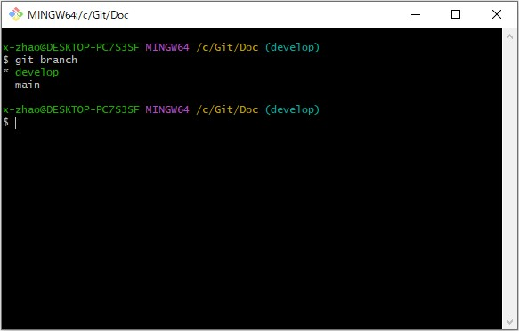

### 1.远程仓库

#### 1.1 克隆远程仓库

 如果想将远程仓库克隆下来，需要使用 **git clone** 命令

```
git clone https://github.com/ChoKyoku/Doc.git
```

https://github.com/ChoKyoku/Doc.git 就是远程仓库的地址


#### 1.2 查看远程分支

使用 **git remote** 命令可以查看远程仓库，origin表示远程主机

使用**git remote -v** 命令可以查看远程仓库详细信息，包括远程仓库的地址


#### 1.3 Git分支管理

##### 1.3.1 列出分支

在git中，使用**git branch** 命令列出所有分支，没有参数的时候就列出本地所有的分支



