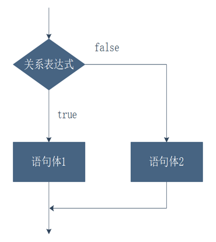
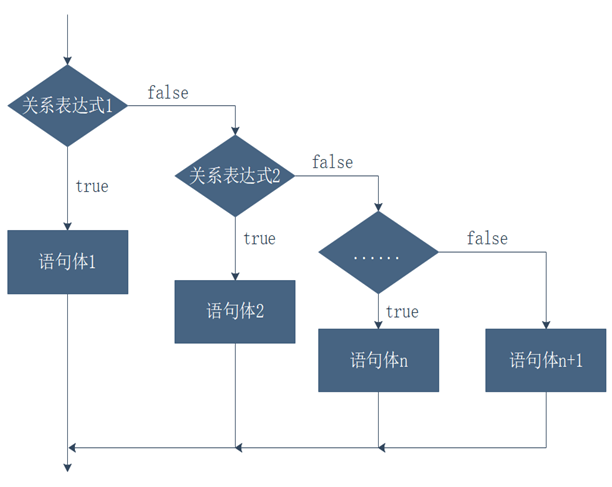
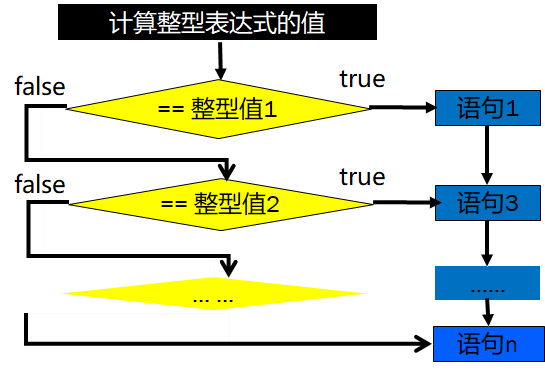

# Day03

## 1.字符串

### 1.字符串的声明方式

#### 1.1 直接赋值

#### 1.2 使用new关键字

#### 1.3 字符串连接运算符 +

+两边同为数字的话则做相加操作。如果有一个操作数为字符串的话则做字符串连接操作。

任何类型的数据与字符串连接，结果都是字符串类型

### 2字符串的常用方法

Java API文档地址：https://www.runoob.com/manual/jdk11api/index.html

#### 2.1 length()

```java
String s1 = "我是张三丰";
int length = s1.length();
System.out.println(s1 + "的长度为:" + length);
```

结果 ：我是张三丰的长度为:5

#### 2.2 equals()

```java
public static void main(String[] args) throws Exception {
		String s1 = new String("我是张三丰");
		String s2 = new String("我是张三丰");
		
		boolean result = s1.equals(s2);
		System.out.println("s1.eqauls(s2)的结果为："+result);
	}
```

结果：s1.eqauls(s2)的结果为：true

#### 2.3 indexOf(String str)

#### 2.4 lastIndexOf(String str)

#### 2.5 split(String str)

#### 2.6 charAt(String str)

#### 2.7 replace(String old,String new)

```java
public class Exercise02 {
	
	public static void main(String[] args) throws Exception {
		String s1 = new String("我是太极宗师张三丰");
		s1 = s1.replace("太极宗师", "****");
		System.out.println(s1);
	}

}
```

输出：我是****张三丰

#### 2.8 substring

**用法1：substring(int beginIndex)**

**用法2：substring(int beginIndex,int endIndex)**

此方法用于提取指定长度的字符串（从索引为beginIndex位置处开始提取，截止到索引为endIndex-1位置处）

```java
public class Exercise02 {
	
	public static void main(String[] args) throws Exception {
		String s1 = new String("我是太极宗师张三丰");
		String result = s1.substring(2,6);
		System.out.println(result);
	}

}
```

result : 太极宗师

### 3 转义字符

\t：表示一个制表符

\n：表示一个换行

\\"：表示一个"

\\'：表示一个'

\\\\：表示一个\


## 2.分支结构

### 1.什么是分支结构

在程序中，有的时候可能需要根据某个条件判断的结果然后再决定需要选择执行哪部分代码的时候就需要使用分支结构。

### 2.Java中的分支结构

1.if结构（1条路）

2.if else 结构（2条路）

3.if else if else 结构（多条路）

4.switch结构

### 3.if 结构

**语法：**

if(boolean){

​	语句体

}

**流程图：**

  

**if结构练习：**

商场正在进行打折销售活动，消费满1000元时，享受8折优惠，请编写一个程序，手动输入消费金额，并且计算出折扣后价格并输出在终端上。

### 4.if ... else 结构

**语法：**

if(boolean){

​	语句块1

}else{

​	语句块2

}

**特点：**语句块1或语句块2必选一块执行

**流程图：**

 

### 5.if ... else if ... else 结构

**语法：**

if(boolean-1){

​     语句块1

​    }else if(boolean-2){

​     语句块2

​    }else if(boolean-3){

​     语句块3

​    }else{

​     语句块4

​    }

​    注意：最后的else并非必要语句

**流程图：**

 

### 6.switch...case 结构

switch case 结构是一种特殊的分支结构，可以根据一个表达式的不同取值从不同的入口开始执行程序。表达式的值可以是整数，也可以是字符。

语法：

switch(表达式){

​	case 值1:

​       语句1

​	   语句2

   case 值2:

​       语句3

   ..... 

   case 值n:

​      语句4

   default:

​      语句n

}


流程图：

 

通常，不同的case对应完全不同的操作，通常和break配合使用

switch(表达式){

​	case 值1:

​       语句1

​	   语句2

​      break；

   case 值2:

​       语句3

​       break；

   ..... 

   case 值n:

​      语句4

​      break；

   default:

​      语句n

​     break；

}

break语句用于跳出switch结构

练习：

根据用户在控制台上不同的输入，执行不同的功能：

输入1：显示存款业务

输入2：显示取款业务

输入3：显示查询余额业务

输入4：显示退卡成功

输入其他数字：显示输入错误