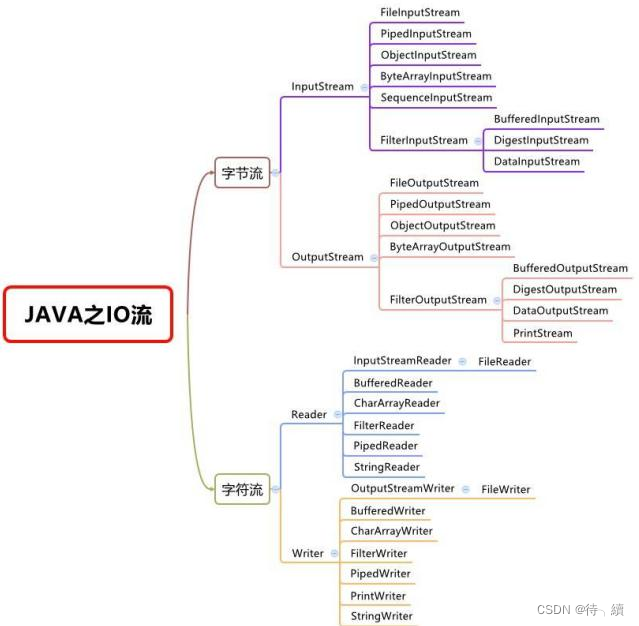
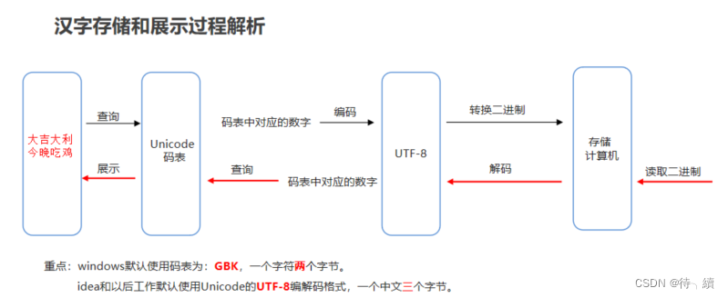

# File

## 1.Java 文件

### 1.1File 类，用于创建文件或目录

File file = new File(String pathName);

File file = new File(Fileparent,String child)

File file = new File(String parent,String child)

File file = new File(URI uri)

ex:

File file = new File("abc.txt") //通过相对路径的方式创建一个文件

### 1.2File的常用方法

isFile() : 判断是否为文件

isDirectory():判断是否为文件夹

exists():判断是否存在

getAbsolutePath():获取文件的绝对路径

getName() : 获取文件名称

getPath():获取文件路径

### 1.3文件操作的常用方法

**1.文件创建**

createFile()

```java
package com.zx.file;

import java.io.File;
import java.io.IOException;

public class RunProgram1 {

	public static void main(String[] args) throws IOException {
		// TODO Auto-generated method stub
		File file = new File("file1.txt");
		if(!file.exists()) {
			file.createNewFile();
		}
	}

}

```

**2.文件夹/目录创建**

mkdir()：只有当父目录存在的时候才能创建子目录

mkdirs() : 会创建所有的目录

```java
package com.zx.file;

import java.io.File;

public class RunProgram1 {

	public static void main(String[] args) {
		// TODO Auto-generated method stub
		File file = new File("C:/x-zhao/file1");
		file.mkdirs();
	}

}

```

**3.文件删除**

delete()

该方法能够删除文件和目录，但目录必须是在为空的情况下才能删除

```java
package com.zx.file;

import java.io.File;

public class RunProgram1 {

	public static void main(String[] args) {
		// TODO Auto-generated method stub
		File file = new File("C:/x-zhao/file1");
		file.delete();
	}

}
```

### 1.4文件属性

1.length()

   列出文件的大小，如果文件不存在的话，则我返回0，返回值类型是long

2.listRoots()

  返回计算机中可用的根目录，该方法是个静态方法

  ```java
package com.zx.file;

import java.io.File;
import java.util.Arrays;
import java.util.List;

public class RunProgram1 {

	public static void main(String[] args) {
		// TODO Auto-generated method stub
		File[] roots = File.listRoots();
		List<File> listRoots = Arrays.asList(roots);
		System.out.println(listRoots);
	}

}
  ```

3.list() / listFiles()

   文件对象的list和listFiles方法用于列出目录中的所有文件和子目录的方法，list方法返回一个String的数组，而listFiles方法返回一个File的数组

```java
package com.zx.file;

import java.io.File;
import java.util.Arrays;
import java.util.List;

public class RunProgram1 {

	public static void main(String[] args) {
		// TODO Auto-generated method stub
		File[] roots = File.listRoots();
		List<File> listRoots = Arrays.asList(roots);
		for(File root : listRoots) {
			File[] childFile = root.listFiles();
			for(File file : childFile) {
				if(file.isFile()) {
					System.out.println(file.getAbsolutePath() + ":"+file.length());
				}else if(file.isDirectory()) {
					System.out.println(file.getAbsolutePath() + "(Directory)");
				}
			}
		}
	}

}

```

### 1.5 作业/练习

```java
package com.zx.stream;

import java.io.File;

public class RunProgram3 {

	public static void main(String[] args) {
		// TODO Auto-generated method stub
		File srcFile = new File("C:/");
		getAllFilePath(srcFile);
	}
	
	//定义一个方法，用于获取给定目录下的所有内容，参数为第1步创建的File对象
    public static void getAllFilePath(File srcFile) {
        //获取给定的File目录下所有的文件或者目录的File数组
        File[] fileArray = srcFile.listFiles();
        //遍历该File数组，得到每一个File对象
        if(fileArray != null) {
            for(File file : fileArray) {
                //判断该File对象是否是目录
                if(file.isDirectory()) {
                    //是：递归调用
                    getAllFilePath(file);
                } else {
                    //不是：获取绝对路径输出在控制台
                    System.out.println(file.getAbsolutePath());
                }
            }
        }
    }

}

```

## 2.流

流的分类，

按照流向分的话主要是输入流和输出流。

流向：输入流，输出流

数据类型分：

​	字节流：可以操作任意类型的文件

​	字符流：只能操作文本文件

 

### 2.1字节流

#### 2.1.1 文件输入流/字节输入流

流，就是数据流。相当于是程序到硬盘中的一个通道。流中的数据可以是字节，字符或是对象。

文件输入流类型：**FileInputStream**

**创建文件输入流：**

File file = **new** File("C:/x-zhao/test.txt");

FileInputStream fis = **new** FileInputStream(file);

**注意：**FileInputStream在使用的过程中可能 会引发FileNotFoundException，所以需要使用try...catch...finally进行处理。此外，流在使用完成后一定要进行关闭，否则会一直占用着资源。

**关闭流：**fis.close()

**读取数据：**

读取数据时使用输入流提供的read方法，该方法可以读取一个字节的数据到程序中，也可以读取多个字节的数据到程序中

read() : 一次读取一个字节

read(byte[]) : 读取多个字节的数据到byte数组中

```java
package com.zx.stream;

import java.io.File;
import java.io.FileInputStream;
import java.io.FileNotFoundException;
import java.io.IOException;

public class RunProgram1 {

	public static void main(String[] args) {
		// TODO Auto-generated method stub
		File file = new File("C:/x-zhao/test.txt");
		if (file.exists()) {
			try (FileInputStream fis = new FileInputStream(file)) {
				byte[] bytes = new byte[1024];
				int len = -1;
				while((len = fis.read(bytes)) != -1) {
					String msg = new String(bytes,0,len);
					System.out.println(len);
					System.out.println(msg);
				}
			} catch (FileNotFoundException e) {
				// TODO: handle exception
				e.printStackTrace();
			} catch (IOException e1) {
				// TODO Auto-generated catch block
				e1.printStackTrace();
			}
		}
	}

}

```

如果想指定编码的读取数据的话可以使用FileInputStream和InputStreamReader一起使用

```java
package com.zx.stream;

import java.io.File;
import java.io.FileInputStream;
import java.io.FileNotFoundException;
import java.io.IOException;
import java.io.InputStreamReader;

public class RunProgram1 {

	public static void main(String[] args) {
		// TODO Auto-generated method stub
		File file = new File("C:/x-zhao/test.txt");
		if (file.exists()) {
			try (FileInputStream fis = new FileInputStream(file);
					InputStreamReader reader = new InputStreamReader(fis, "UTF-8")) {
				int data;
				while((data = reader.read()) != -1) {
					System.out.println(data);
					System.out.println((char)data);
				}
			} catch (FileNotFoundException e) {
				// TODO Auto-generated catch block
				e.printStackTrace();
			} catch (IOException e) {
				// TODO Auto-generated catch block
				e.printStackTrace();
			}
		}
	}

}

```

一次读取一行数据

FileReader 和  BufferedReader

```java
package com.zx.stream;

import java.io.BufferedReader;
import java.io.File;
import java.io.FileReader;
import java.io.IOException;

public class RunProgram1 {

	public static void main(String[] args) {
		// TODO Auto-generated method stub
		File file = new File("C:/x-zhao/test.txt");
		if (file.exists()) {
			try (FileReader in = new FileReader(file); BufferedReader reader = new BufferedReader(in)) {
				String line;
				while((line = reader.readLine()) != null) {
					System.out.println(line);
				}
			} catch (IOException e) {
				// TODO: handle exception
				e.printStackTrace();
			}
		}
	}

}

```

#### 2.1.2 文件输出流/字节输出流

Java文件输出流主要使用的是java.io.FileOutputStream类来实现。

```java
package com.zx.stream;

import java.io.File;
import java.io.FileNotFoundException;
import java.io.FileOutputStream;
import java.io.IOException;

public class RunProgram2 {
	public static void main(String[] args) {
		File file = new File("C:/x-zhao/test-20240618.txt");
		FileOutputStream fos = null;
		try {
			fos = new FileOutputStream(file);
			String data = "Hello \nword";
			byte[] byteDatas = data.getBytes();
			fos.write(byteDatas);
			fos.flush();
		} catch (FileNotFoundException e) {
			// TODO Auto-generated catch block
			e.printStackTrace();
		} catch (IOException e) {
			e.printStackTrace();
		} finally {
			if(fos != null) {
				try {
					fos.close();
				} catch (IOException e) {
					// TODO Auto-generated catch block
					e.printStackTrace();
				} finally {
					fos = null;
				}
			}
		}
		
 	}
}

```

### 2.2 字符流

字符流，只能处理文本文件。将文件中的数据读入到内存时，如果里面包含汉字的时候，如果使用字节流，就会出现乱码的现象。如果是纯文本的话，就推荐使用字符流来处理。

1）基础知识：

 计算机中储存的信息都是用二进制数表示的；我们在屏幕上看到的英文、汉字等字符是二进制数转换之后的结果
按照某种规则，将字符存储到计算机中，称为编码。
按照同样的规则，将存储在计算机中的二进制数解析显示出来，称为解码 。
编码和解码的方式必须一致，否则会导致乱码。      

简单理解：              

存储一个字符a，首先需在码表中查到对应的数字是97，然后按照转换成二进制的规则进行存储。  读取的时候，先把二进制解析出来，再转成97，通过97查找到对应的字符是a。

（2）类别：

               ASCII字符集： ASCII(American Standard Code for Information Interchange，美国信息交换标准代码)：包括了数字，大小写字符和一些常见的标点符号。
    
               注意：ASCII码表中是没有中文的。
    
               GBK：window系统默认的码表。兼容ASCII码表，也包含了21003个汉字，并支持繁体汉字以及部分日韩文字。
    
                注意：GBK是中国的码表，一个中文以两个字节的形式存储。但不包含世界上所有国家的文字 
    
                Unicode码表：由国际组织ISO 制定，是统一的万国码，计算机科学领域里的一项业界标准，容纳世界上大多数国家的所有常见文字和符号。但是因为表示的字符太多，所以Unicode码表中的数字不是直接以二进制的形式存储到计算机的，会先通过UTF-7，UTF-7.5，UTF-8，UTF-16，以及 UTF-32的编码方式再存储到计算机，其中最为常见的就是UTF-8。
    
                注意： Unicode是万国码，以UTF-8编码后一个中文以三个字节的形式存储
　

字符串中的编码解码问题：

编码：

byte[] getBytes()：使用平台的默认字符集将该 String编码为一系列字节，将结果存储到新的字节数组中

byte[] getBytes(String charsetName)：使用指定的字符集将该 String编码为一系列字节，将结果存储到新的字节数组中


解码：

String(byte[] bytes)：通过使用平台的默认字符集解码指定的字节数组来构造新的 String 

String(byte[] bytes, String charsetName)：通过指定的字符集解码指定的字节数组来构造新的 String

#### 2.2.1 字符输入流

类：FileReader

字符流读取数据的两种方式：

| 方法                  | 说明                     |
| --------------------- | ------------------------ |
| int read()            | 一次读一个字符的数据     |
| int read(char[] cbuf) | 一次读一个字符数组的数据 |

```java
package com.zx.stream;

import java.io.File;
import java.io.FileNotFoundException;
import java.io.FileReader;
import java.io.IOException;

public class RunProgram4 {
	public static void main(String[] args) {
		File file = new File("C:/x-zhao/test.txt");
		FileReader fileReader = null;
		int data = 0;
		try {
			fileReader = new FileReader(file);
			while((data = fileReader.read()) != -1 ) {
				System.out.println((char)data);
			}
		} catch (FileNotFoundException e) {
			// TODO Auto-generated catch block
			e.printStackTrace();
		} catch (IOException e) {
			e.printStackTrace();
		} finally {
			if(fileReader != null) {
				try {
					fileReader.close();
				} catch (IOException e) {
					// TODO Auto-generated catch block
					e.printStackTrace();
				} finally {
					fileReader = null;
				}
			}
		}
	}
}

```

```java
package com.zx.stream;

import java.io.File;
import java.io.FileNotFoundException;
import java.io.FileReader;
import java.io.IOException;

public class RunProgram4 {
	public static void main(String[] args) {
		File file = new File("C:/x-zhao/test.txt");
		FileReader fileReader = null;
		char[] datas = new char[1024];
		int readLen = 0;
		try {
			fileReader = new FileReader(file);
			while((readLen = fileReader.read(datas)) != -1 ) {
				System.out.println(new String(datas,0,readLen));
			}
		} catch (FileNotFoundException e) {
			// TODO Auto-generated catch block
			e.printStackTrace();
		} catch (IOException e) {
			e.printStackTrace();
		} finally {
			if(fileReader != null) {
				try {
					fileReader.close();
				} catch (IOException e) {
					// TODO Auto-generated catch block
					e.printStackTrace();
				} finally {
					fileReader = null;
				}
			}
		}
	}
}

```

#### 2.2.2 字符输出流

类：FileWriter

步骤：

创建字符输出流对象

​	如果文件不存在，则创建

​	如果文件存在，则清空

写数据

​	写int类型的整数，实际写出的是整数对应的字母

​	写字符串数据的话，就把字符串本身写出

释放资源

方法：

| 方法名                                     | 说明                                                     |
| ------------------------------------------ | -------------------------------------------------------- |
| void write(int c)                          | 写入一个字符                                             |
| void write(char[] cbuf)                    | 写入一个字符数组                                         |
| void write(char[] cbuf ,int off , int len) | 写入一个字符数组的一部分                                 |
| void write(String str)                     | 写入一个字符串                                           |
| void write(String str,int off,int len)     | 写入一个字符串的一部分                                   |
| flush()                                    | 刷新流，还可以继续写入数据                               |
| close()                                    | 关闭流，关闭之前会先刷新流，一旦关闭后，就不能再写数据了 |

```java
import java.io.File;
import java.io.FileWriter;
import java.io.UnsupportedEncodingException;

public class RunProgram1 {

	public static void main(String[] args) throws UnsupportedEncodingException {
		// TODO Auto-generated method stub
		String str = "你好，こんにちは\n爱我中华";
		File file = new File("abc.txt");
		try (FileWriter writer = new FileWriter(file,true)) {
			writer.write(str);
		} catch (Exception ex) {
			ex.printStackTrace();
		}
	}

}

```

